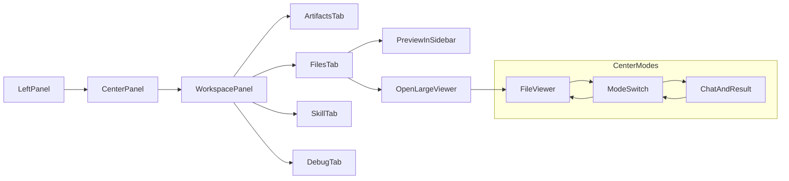

# Agent Workspace 重建规划

## 背景

当前项目准备回滚最近一轮 `Agent 工作台 / Workspace 面板` 的实现，但这轮探索已经沉淀出清晰的交互方向。为避免回滚后重新讨论，本文件用于记录下一轮重建时应直接落实的产品目标、信息架构和实现范围。

本规划面向两类场景：

- 对外演示：让非技术观众理解 Agent 正在做什么、产出了什么。
- 技术透明与调试：让技术观众和开发者直接查看 `SKILL.md`、脚本、日志、`.tool-results`、`history.json` 等真实工作区对象。

## 已确认的设计取舍

### 1. 保留右侧 `Workspace` 面板

右侧 `Workspace` 仍然是核心入口，用于展示逻辑 Docker `/workspace`。

保留标签结构：

- `工件`
- `文件系统`
- `Skill`
- `调试`

并要求支持：

- 可收起 / 可展开
- 右侧宽度可拖拽调整
- 会话完成、上传文件、生成新文件后自动刷新

### 2. 不采用“长文件摘要 + 打开全文”策略

这个策略已被明确否定。

原因：

- `SKILL.md`
- `.tool-results/*.txt`
- `chat.log`
- `history.json`

这些本来就是典型长文件，而且它们恰恰是最需要透明查看的内容。

因此后续实现必须坚持：

- 预览与阅读都默认展示**全量内容**
- 不做“自动摘要替代全文”
- 可以有滚动、分页加载、懒渲染，但不能用摘要取代正文

### 3. 长文件查看采用“三层能力”组合

下一轮实现不是只选一种，而是组合使用以下 3 个能力：

#### 能力 A：右侧侧栏内即时查看

右侧 `Workspace` 内仍保留文件预览区，支持快速浏览当前选中文件的正文。

适用：

- 快速确认内容
- 在不离开工作台的前提下查看文件

#### 能力 B：大视图 / 放大查看

右侧预览区必须支持“展开查看”。

推荐形式：

- 点击 `展开查看` 后，使用中间主区域或覆盖层显示大号文档查看器
- 不要只依赖小侧栏承载长文档阅读

适用：

- `SKILL.md`
- `.tool-results/*.txt`
- `chat.log`
- `history.json`
- `temp/*.py`

#### 能力 C：中间区切换到“文件查看模式”

中间主区域不应只承载聊天和结果，还要支持切换到一个更大的“文件查看模式”。

推荐中间区模式：

- `对话 / 结果`
- `文件查看`

当用户从右侧点开长文件时，中间区切换为“文件查看”，右侧仍保留文件树与上下文。

这样既不丢失工作台结构，又能真正读长文件。

### 4. 右侧宽度必须可拖拽

右侧 `Workspace` 的宽度不能固定死。

建议范围：

- 最小宽度：`320px`
- 默认宽度：`400px`
- 最大宽度：`50vw` 或 `720px`

要求：

- 拖拽手柄可见
- 宽度状态前端持久化（可放到 `localStorage`）
- 收起后恢复到上次展开宽度

### 5. `Workspace` 展示的是“逻辑 Docker /workspace”

仍然沿用逻辑映射，而不是强依赖实时探测容器内部文件系统。

映射规则：

- `/workspace/uploads` -> `sessions/{id}/uploads`
- `/workspace/output` -> `sessions/{id}/output`
- `/workspace/temp` -> `sessions/{id}/temp`
- `/workspace/.tool-results` -> `sessions/{id}/.tool-results`
- `/workspace/chat.log` -> `sessions/{id}/chat.log`
- `/workspace/history.json` -> `sessions/{id}/history.json`
- `/workspace/skills` -> 仓库 `skills/` 目录（只读）

这个逻辑视图足够贴近 Docker workspace，也更适合讲解。

## 目标界面结构

建议采用三栏结构：

- 左侧：会话与输入入口
- 中间：对话 / 结果 / 文件查看
- 右侧：可收起、可拖拽的 `Workspace`

## 中间区重建要求

### 模式 1：对话 / 结果

保留现在的：

- 聊天消息
- Thinking / Tool 调用过程
- 图表与结构化结果

### 模式 2：文件查看

新增大号文件查看器，要求：

- 顶部显示逻辑路径
- 显示文件大小、更新时间、只读状态
- 支持 Markdown 渲染
- 支持纯文本 / JSON / 日志 / Python 脚本等等宽显示
- 支持滚动
- 支持返回对话/结果

适合承载“真正读文件”的动作。

## 右侧 `Workspace` 面板重建要求

### A. 标签保留

- `工件`
- `文件系统`
- `Skill`
- `调试`

### B. 文件树必须覆盖关键目录

至少包括：

- `uploads/`
- `output/`
- `temp/`
- `.tool-results/`
- `skills/`
- `chat.log`
- `history.json`

### C. `skills/` 必须标明只读

这是对技术观众很重要的解释点。

### D. 文件点击行为

点击文件后需要至少支持两步：

1. 右侧即时预览
2. 一键切到中间大查看器

### E. 长文件不做摘要替代

允许滚动和性能优化，但默认语义必须是“查看完整文件”。

## 后端接口要求

保留或重建以下接口能力：

- `GET /sessions/{session_id}/workspace`
- `GET /sessions/{session_id}/workspace/file`

并确保：

- 隐藏目录 `.tool-results` 必须能展示
- `SKILL.md` 能读取
- `chat.log`、`history.json` 能读取
- `temp/*.py` 能读取

如果担心性能，可做：

- 大文本分段加载
- 首次请求返回全文，前端虚拟滚动
- 或后端返回正文并带 `truncated=false`

但不要只返回摘要。

## 前端实现建议

### 需要重建或重点修改的文件

- `frontend/src/copilot/ChatLayout.tsx`
- `frontend/src/copilot/components/WorkspacePanel.tsx`
- 可新增：`frontend/src/copilot/components/FileViewer.tsx`
- 可新增：`frontend/src/copilot/components/WorkspaceResizeHandle.tsx`
- `frontend/src/lib/api.ts`
- `frontend/src/types.ts`

### 推荐组件拆分

- `WorkspacePanel`
- `WorkspaceTabs`
- `WorkspaceFileTree`
- `WorkspacePreview`
- `FileViewer`
- `ResizeHandle`

这样后续维护会比把逻辑全塞进 `WorkspacePanel.tsx` 更稳定。

## 交互优先级

第一优先级：

- 右侧面板可收起
- 右侧面板可拖拽调宽
- 点击文件后可在中间全量查看

第二优先级：

- `Skill` 标签里直接查看 `SKILL.md`
- `.tool-results` 与 `temp/` 快速入口
- 本轮新增 / 最近修改文件高亮

第三优先级：

- 阅读位置记忆
- JSON / 日志视图增强
- 路径复制、在工作台中展开等细节能力

## 验收标准

完成后应满足：

1. 我打开页面后，右侧能看到可收起、可拖拽的 `Workspace`
2. 文件树中能看到 `uploads`、`output`、`temp`、`.tool-results`、`skills`
3. `Skill` 标签能查看当前会话的 `SKILL.md`
4. 点击长文件后，不是摘要，而是能查看完整内容
5. 右侧查看不够时，可以切到中间大号文件查看模式
6. 会话执行后，右侧能反映新增文件和调试文件变化

## 说明

本规划是为“代码回滚后重新实现”准备的目标文档。

它继承了上一轮工作的核心方向，但明确修正了一点：

- 不再接受“长文件摘要 + 打开全文”的产品策略
- 改为“全量可见 + 多层阅读模式”
